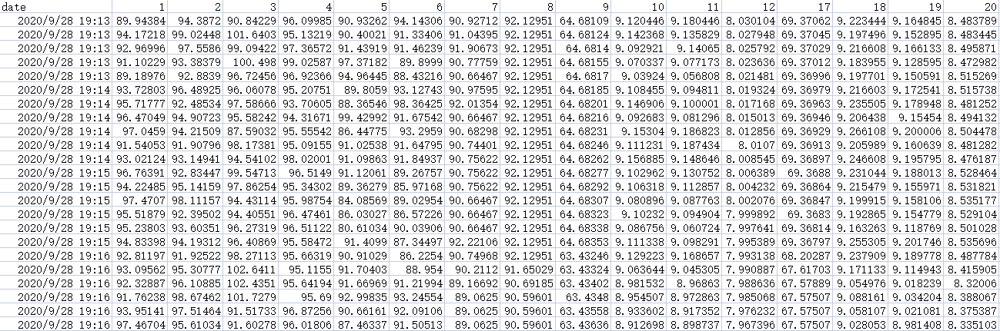
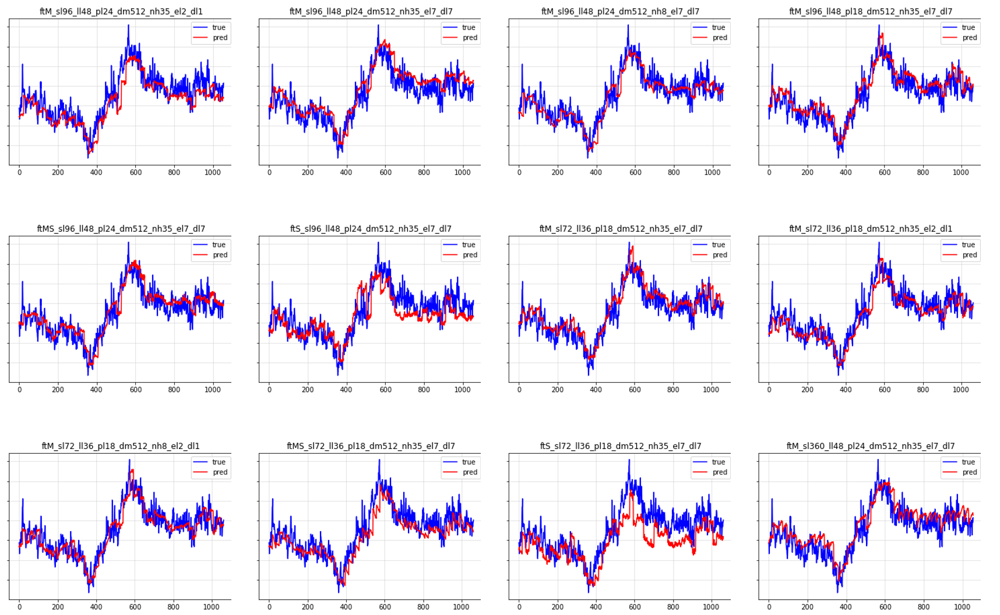
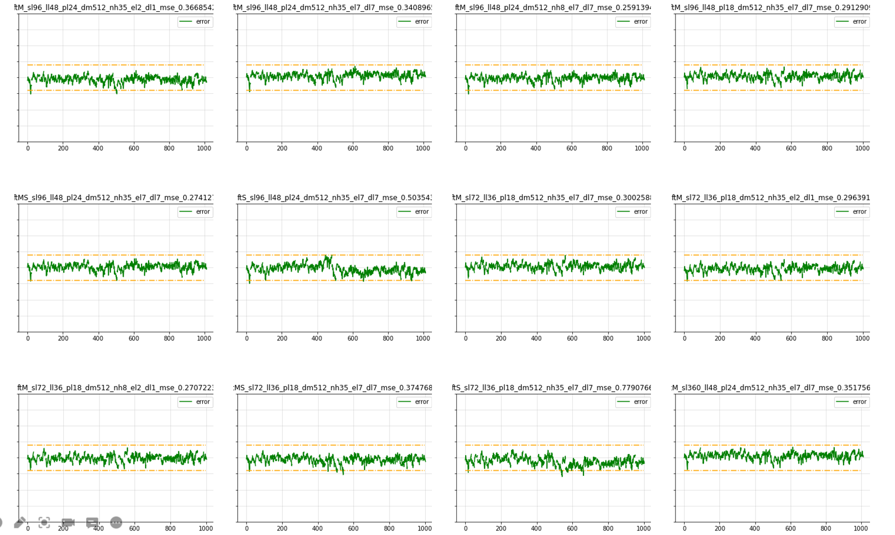

# This is a Informer time series prediction project for ZFDH
Informer: Beyond Efficient Transformer for Long Sequence Time-Series Forecasting (AAAI'21 Best Paper)
This is the origin Pytorch implementation of Informer in the following paper: 
[Informer: Beyond Efficient Transformer for Long Sequence Time-Series Forecasting](https://arxiv.org/abs/2012.07436). Special thanks to `Jieqi Peng`@[cookieminions](https://github.com/cookieminions) for building this repo.

## Data

The ZFDH(like ETT format) dataset used in the paper can be download in the repo [ETDataset](https://github.com/zhouhaoyi/ETDataset).
The required data files should be put into `data/ETT/` folder. A demo slice of the ETT data is illustrated in the following figure. Note that the input of each dataset is zero-mean normalized in this implementation.

 

## Pred Results

 

## Mse Error

 

